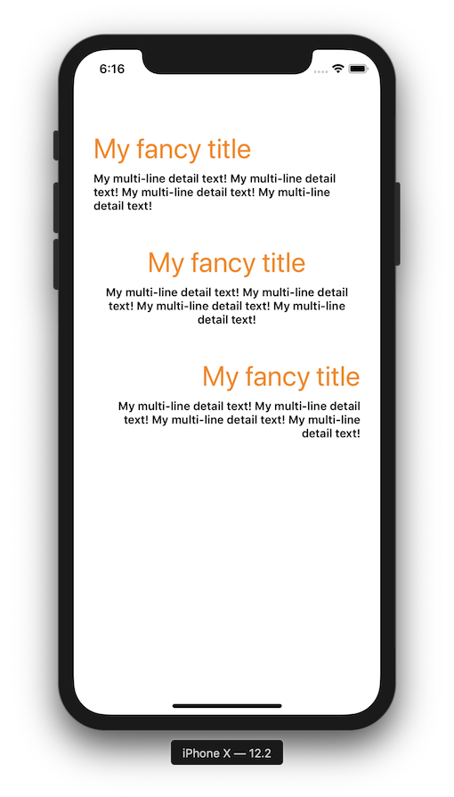

<p align="center">
   <a href="https://developer.apple.com/swift/">
      
   </a>
   <a href="http://cocoapods.org/pods/MUHeader">
      
   </a>
   <a href="http://cocoapods.org/pods/MUHeader">
      
   </a>
   <a href="https://github.com/Carthage/Carthage">
      
   </a>
   <a href="https://github.com/apple/swift-package-manager">
      
   </a>
</p>

# MUHeader

<p align="center">
MUHeader provides a reusable component to show a title and detail label with `UIAppearance` customization
</p>

<p align="center">

</p>

## Features

- [x] UIAppearance customization
- [x] Easy to reuse in all your projects
- [x] Storyboard and frame compatible
- [x] Easy to include in custom view

## Example

The example application is the best way to see `MUHeader` in action. Simply open the `MUHeader.xcodeproj` and run the `Example` scheme.

## Installation

### CocoaPods

MUHeader is available through [CocoaPods](http://cocoapods.org). To install
it, simply add the following line to your Podfile:

```bash
pod 'MUHeader'
```

### Carthage

[Carthage](https://github.com/Carthage/Carthage) is a decentralized dependency manager that builds your dependencies and provides you with binary frameworks.

To integrate MUHeader into your Xcode project using Carthage, specify it in your `Cartfile`:

```ogdl
github "MoveUpwards/MUHeader"
```

Run `carthage update` to build the framework and drag the built `MUHeader.framework` into your Xcode project. 

On your application targets’ “Build Phases” settings tab, click the “+” icon and choose “New Run Script Phase” and add the Framework path as mentioned in [Carthage Getting started Step 4, 5 and 6](https://github.com/Carthage/Carthage/blob/master/README.md#if-youre-building-for-ios-tvos-or-watchos)

### Swift Package Manager

To integrate using Apple's [Swift Package Manager](https://swift.org/package-manager/), add the following as a dependency to your `Package.swift`:

```swift
dependencies: [
    .package(url: "https://github.com/MoveUpwards/MUHeader.git", from: "1.0.0")
]
```

### Manually

If you prefer not to use any of the aforementioned dependency managers, you can integrate MUHeader into your project manually. Simply drag the `Sources` Folder into your Xcode project.

## Usage

### Code snippet

```swift
let header = MUHeader()
header.title = "My fancy title"
header.titleColor = .orange
header.detail = "My multi-line detail text!"
header.detailColor = .black
```

### UIAppearance styling

Overall application styling

```swift
MUHeader.appearance().titleColor = .orange
MUHeader.appearance().titleFont = .systemFont(ofSize: 24.0, weight: .bold)
MUHeader.appearance().detailColor = .black
MUHeader.appearance().detailFont = .systemFont(ofSize: 14.0, weight: .regular)
MUHeader.appearance().spacing = 2
MUHeader.appearance().textAlignment = .left
```

Specific parent class styling

```swift
for vc in [MyCustomClass.self] {
   MUHeader.appearance(whenContainedInInstancesOf: [vc]).titleColor = .orange
   MUHeader.appearance(whenContainedInInstancesOf: [vc]).titleFont = .systemFont(ofSize: 24.0, weight: .bold)
   MUHeader.appearance(whenContainedInInstancesOf: [vc]).detailColor = .black
   MUHeader.appearance(whenContainedInInstancesOf: [vc]).detailFont = .systemFont(ofSize: 14.0, weight: .regular)
   MUHeader.appearance(whenContainedInInstancesOf: [vc]).spacing = 2
   MUHeader.appearance(whenContainedInInstancesOf: [vc]).textAlignment = .left
}


```

### Available properties

```swift
/// The current title.
@IBInspectable open var title: String = ""

/// The title’s font.
@objc open dynamic var titleFont: UIFont = .systemFont(ofSize: 34.0, weight: .regular)

/// The title’s text color.
@IBInspectable open dynamic var titleColor: UIColor = .black

// MARK: - Detail Label

/// The current detail description.
@IBInspectable open var detail: String = ""

/// The detail’s font.
@objc open dynamic var detailFont: UIFont = .systemFont(ofSize: 14.0, weight: .semibold)

/// The detail’s text color.
@IBInspectable open dynamic var detailColor: UIColor = .black

/// The text’s horizontal alignment.
@objc open dynamic var textAlignment: NSTextAlignment = .left

/// Optional: The IBInspectable version of the text’s horizontal alignment.
@IBInspectable open var textAlignmentInt: Int

/// The text’s vertical spacing.
@IBInspectable open dynamic var spacing: CGFloat = 8.0
```

## Contributing
Contributions are very welcome 🙌

## License

```
MUHeader
Copyright (c) 2019 Move Upwards contact@moveupwards.dev

Permission is hereby granted, free of charge, to any person obtaining a copy
of this software and associated documentation files (the "Software"), to deal
in the Software without restriction, including without limitation the rights
to use, copy, modify, merge, publish, distribute, sublicense, and/or sell
copies of the Software, and to permit persons to whom the Software is
furnished to do so, subject to the following conditions:

The above copyright notice and this permission notice shall be included in
all copies or substantial portions of the Software.

THE SOFTWARE IS PROVIDED "AS IS", WITHOUT WARRANTY OF ANY KIND, EXPRESS OR
IMPLIED, INCLUDING BUT NOT LIMITED TO THE WARRANTIES OF MERCHANTABILITY,
FITNESS FOR A PARTICULAR PURPOSE AND NONINFRINGEMENT. IN NO EVENT SHALL THE
AUTHORS OR COPYRIGHT HOLDERS BE LIABLE FOR ANY CLAIM, DAMAGES OR OTHER
LIABILITY, WHETHER IN AN ACTION OF CONTRACT, TORT OR OTHERWISE, ARISING FROM,
OUT OF OR IN CONNECTION WITH THE SOFTWARE OR THE USE OR OTHER DEALINGS IN
THE SOFTWARE.
```
